## New Draft (March 17th 2025) of OSI Layers grouped into Web App parent-layer concerns

Note for Tjelvar: This diagram is my first attempt at making sense of this from a middleware (Sveltekit) and frontend UI (Svelte) point of view.

My main emphasis was separating Svelte and Sveltekit responsibilites. Feel free to ask further details to clear up everything. I'm unfamiliar with OSI communications model so I'd need your help on that end.

I suspect, in the end, it'd have to be a compromise between communications modelling and web server/browser client modelling to simplify this diagram into an actionable snapshot.

SOME REDUNDANCY: Layer 2 and Layer 7 might have too much overlap but that could also be me not knowing the OSI model.

```mermaid
flowchart TD
    %% Define color styles
    classDef baseLayer fill:#d4f1f9,stroke:#05a,stroke-width:2px
    classDef coreLayer fill:#ffe6cc,stroke:#d79b00,stroke-width:2px
    classDef derivedLayer fill:#d5e8d4,stroke:#82b366,stroke-width:2px
    classDef routerLayer fill:#e1d5e7,stroke:#9673a6,stroke-width:2px
    classDef platformLayer fill:#f5f5f5,stroke:#666,stroke-width:2px

    %% Platform Layer
    subgraph "Layer 1: Webview Container"
        L1["/static/frame.html"] --> Webview["Browser/WebView"]
        Webview --> Scaling["UI Scaling"]
    end
    class Layer1 platformLayer

    %% Base Layer
    subgraph "Interal Layers"
        subgraph "Layer 3: Internal UI"
            InternalUI["$lib/internal"] --> UIKnobs["Knob Components"]
            InternalUI --> UIButtons["Button Components"]
            InternalUI --> UISliders["Slider Components"]
        end

        subgraph "Layer 4: Module"
            L4["Module Files"] --> FunctionalUnits["Functional Units"]
            FunctionalUnits --> Synths["Synthesizers"]
            FunctionalUnits --> Effects["Audio Effects"]
            FunctionalUnits --> Processors["MIDI Processors"]
        end
    end
    class BaseLayer,Layer3,Layer4 baseLayer

    %% Derived Layer
    subgraph "External Layers"
        subgraph "Layer 5: Page / Module Host"
            L5["Page Files"] --> ModuleHost["Module Host"]
            ModuleHost --> StateData["State Management"]
            ModuleHost --> DynamicModules["Dynamic Module Loading"]
            ModuleHost --> LayoutManagement["Layout Management"]
        end

        subgraph "Layer 6: Window Manager"
            L6["Window Manager Files"] --> WindowSystem["Window System"]
            WindowSystem --> Modals["Modal Windows"]
            WindowSystem --> DraggableWindows["Draggable Windows"]
            WindowSystem --> Overlays["Overlays"]
        end

		%% Static Assets
    subgraph "Layer 2: Static Assets & Response APIs"
        Assets["Static Assets"] --> InteractionTypes
        CSS["CSS Stylesheet"] -- apply UI styles at build time --> WebApp
        WebApp["Browser DOM entry point app.html"] --> TouchEvents["Multitouch Events"]
        TouchEvents --> InteractionTypes["Touch Interaction Types"]
        InteractionTypes --> Knobs["Knobs (delta-X/Y)"]
        InteractionTypes --> Keys["Keys (on/off)"]
        InteractionTypes --> Sliders["Sliders"]
    end

    end
    class DerivedLayer,Layer2,Layer5,Layer6,Layer7 derivedLayer

    %% SvelteKit Router
    subgraph "SvelteKit"
        Router["Router"] --> Routes["+page.svelte"]
        Preprocessor -- serve static files on build --> Assets
        Router --> AppServerFiles
        Layouts --> WebSockets["WebSocket Communication"]
        Router --> Layouts["+layout.svelte"]
        Router --> APIRoutes["API Routes"]
        Routes --> DynamicRoutes["Dynamic Routes [slug]"]

		subgraph "Layer 7: App Definition"
            AppServerFiles["Web App Server"]
            AppServerFiles --> Navigation["Navigation Flow"]
            AppServerFiles --> UXConsistency["UX Consistency"]
        end
    end
    class SvelteKitRouter routerLayer

    %% C++ Backend
    subgraph "Core Layer: C++ Backend"
        CPP["C++ Engine"] --> AudioEngine["Audio Processing"]
        CPP --> MIDIEngine["MIDI Processing"]
        CPP --> SocketServer["WebSocket Server"]
    end
    class CoreLayerCBackend coreLayer

    %% Connections between elements
    Scaling -- guard for cross-platform responsiveness --> WebApp
    WebSockets <--> SocketServer
    TouchEvents --> InternalUI
    InternalUI --> FunctionalUnits
    FunctionalUnits --> ModuleHost
    ModuleHost --> Router
    WindowSystem --> ModuleHost
    Router --> ModuleHost
    CPP <--> L4
```

